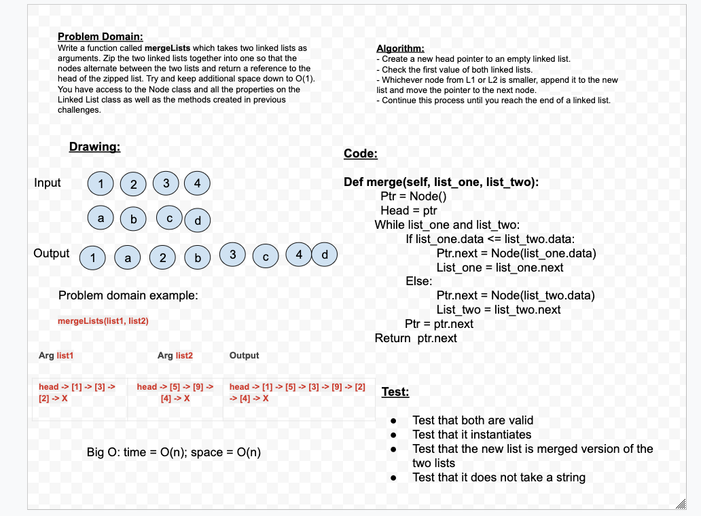

# data-structures-and-algorithms-python

## Reverse an Array

## Challenge
- Write a function called reverseArray which takes an array as an argument. Without utilizing any of the built-in methods available to your language, return an array with elements in reversed order.
## Approach & Efficiency
- Takes users data for the array they want to fill 
- While loop that remains infinite as long as two requirements are meant 
- While loop so the user can add as many things to the index as they want next we reverse the array by a slice method by taking the array filled with the user input data and prints it backwards
## Solution
- While loop to populate the array with inputs and uses a slice method that reverses the array so that the data that is appended shows up backwards

[Whiteboard](/Users/nataliesinner/codefellows/401/data-structures-and-algorithms-python/assets/array_reverse.jpeg)

## Array Shift

## Challenge
- Write a function called insertShiftArray which takes in an array and the value to be added. Without utilizing any of the built-in methods available to your language, return an array with the new value added at the middle index.
## Approach & Efficiency
- My approach was to allow the user to pick the item they want inserted in middle of the array then found the midpoint and inserted them between the index numbers
## Solution
- Find midpoint in array then insert the item you want in the middle of the array
[Whiteboard](/Users/nataliesinner/codefellows/401/data-structures-and-algorithms-python/assets/array_shift.jpeg)

## Array Binary Search

## Challenge
- Write a function called BinarySearch which takes in 2 parameters: a sorted array and the search key. Without utilizing any of the built-in methods available to your language, return the index of the array’s element that is equal to the search key, or -1 if the element does not exist.
## Approach & Efficiency
- My approach was to allow the user to pick a number and be able to tell if that number was in the array by showing a 2 if it was and a -1 if it was not. 
## Solution
- Find if user picked number that was in array by showing 2 if it is and -1 if it is not. 
[Whiteboard/Google Doc](https://docs.google.com/document/d/1sBieMTDNo6zWNvBqY8s-5npQkK0uGUZemvrp6tvqasE/edit?usp=sharing) 

# Singly Linked List

## Challenge
Create a Node class that has properties for the value stored in the Node, and a pointer to the next Node.
Within your LinkedList class, include a head property. Upon instantiation, an empty Linked List should be created.

## Approach & Efficiency
I followed the demo code and worked off of that. 

## API
<!-- Description of each method publicly available to your Linked List -->

# Merge two linked lists
- Merge teo linked list together. 

## Challenge Description
- Write a function called mergeLists which takes two linked lists as arguments. Zip the two linked lists together into one so that the nodes alternate between the two lists and return a reference to the head of the zipped list. Try and keep additional space down to O(1). You have access to the Node class and all the properties on the Linked List class as well as the methods created in previous challenges.

## Approach & Efficiency
- My approach was to merge two linked list together to create one new linked list. Time = O(n); space = O(n)

## Solution

# Stacks and Queues
Python: a folder named stacks_and_queues which contains a file called stacks_and_queues.py

## Challenge
Create a Node class that has properties for the value stored in the Node, and a pointer to the next node.
Create a Stack class that has a top property. It creates an empty Stack when instantiated.
This object should be aware of a default empty value assigned to top when the stack is created.
Define a method called push which takes any value as an argument and adds a new node with that value to the top of the stack with an O(1) Time performance.
Define a method called pop that does not take any argument, removes the node from the top of the stack, and returns the node’s value.
Should raise exception when called on empty stack
Define a method called peek that does not take an argument and returns the value of the node located on top of the stack, without removing it from the stack.
Should raise exception when called on empty stack
Define a method called isEmpty that takes no argument, and returns a boolean indicating whether or not the stack is empty.
Create a Queue class that has a front property. It creates an empty Queue when instantiated.
This object should be aware of a default empty value assigned to front when the queue is created.
Define a method called enqueue which takes any value as an argument and adds a new node with that value to the back of the queue with an O(1) Time performance.
Define a method called dequeue that does not take any argument, removes the node from the front of the queue, and returns the node’s value.
Should raise exception when called on empty queue
Define a method called peek that does not take an argument and returns the value of the node located in the front of the queue, without removing it from the queue.
Should raise exception when called on empty queue
Define a method called isEmpty that takes no argument, and returns a boolean indicating whether or not the queue is empty.
Be sure to follow your languages best practices for naming conventions.
You have access to the Node class and all the properties on the Linked List class.

Structure and Testing
Utilize the Single-responsibility principle: any methods you write should be clean, reusable, abstract component parts to the whole challenge. You will be given feedback and marked down if you attempt to define a large, complex algorithm in one function definition.

Write tests to prove the following functionality:

Can successfully push onto a stack
Can successfully push multiple values onto a stack
Can successfully pop off the stack
Can successfully empty a stack after multiple pops
Can successfully peek the next item on the stack
Can successfully instantiate an empty stack
Calling pop or peek on empty stack raises exception
Can successfully enqueue into a queue
Can successfully enqueue multiple values into a queue
Can successfully dequeue out of a queue the expected value
Can successfully peek into a queue, seeing the expected value
Can successfully empty a queue after multiple dequeues
Can successfully instantiate an empty queue
Calling dequeue or peek on empty queue raises exception
Ensure your tests are passing before you submit your solution.

## Approach & Efficiency
O(1) for both Stacks and Queues.

## API
<!-- Description of each method publicly available to your Stack and Queue-->

# Challenge Summary
Implement a Queue using two Stacks.

## Challenge Description
Create a brand new PseudoQueue class. Do not use an existing Queue. Instead, this PseudoQueue class will implement our standard queue interface (the two methods listed below), but will internally only utilize 2 Stack objects. Ensure that you create your class with the following methods:

enqueue(value) which inserts value into the PseudoQueue, using a first-in, first-out approach.
dequeue() which extracts a value from the PseudoQueue, using a first-in, first-out approach.
The Stack instances have only push, pop, and peek methods. You should use your own Stack implementation. Instantiate these Stack objects in your PseudoQueue constructor.

## Approach & Efficiency
Both enqueue and dequeue are O(n) time and O(1) space

## Solution
[Whiteboard](assets/PseudoQueue.png)

# Challenge Summary
First-in, First out Animal Shelter.

## Challenge Description
Create a class called AnimalShelter which holds only dogs and cats. The shelter operates using a first-in, first-out approach.
Implement the following methods:
enqueue(animal): adds animal to the shelter. animal can be either a dog or a cat object.
dequeue(pref): returns either a dog or a cat. If pref is not "dog" or "cat" then return null.

## Approach & Efficiency
For the enqueue(animal) method time big O(1), space big O(1) For the dequeue(pref) method time big O(n), space big O(n)

## Solution
[Whiteboard](assets/animial_shelter.png)

# Challenge Summary
Multi-bracket Validation.

## Challenge Description
Your function should take a string as its only argument, and should return a boolean representing whether or not the brackets in the string are balanced. There are 3 types of brackets:

Round Brackets : ()
Square Brackets : []
Curly Brackets : {}

## Approach & Efficiency
Both enqueue and dequeue are O(n) time and O(n) space

## Solution
[Whiteboard](assets/multi_bracket_validation.png)

# Challenge Summary
Binary Tree and BST Implementation

## Challenge Description
Create a Node class that has properties for the value stored in the node, the left child node, and the right child node.
Create a BinaryTree class
Define a method for each of the depth first traversals called preOrder, inOrder, and postOrder which returns an array of the values, ordered appropriately.
Any exceptions or errors that come from your code should be semantic, capturable errors. For example, rather than a default error thrown by your language, your code should raise/throw a custom, semantic error that describes what went wrong in calling the methods you wrote for this lab.

Create a BinarySearchTree class
Define a method named add that accepts a value, and adds a new node with that value in the correct location in the binary search tree.
Define a method named contains that accepts a value, and returns a boolean indicating whether or not the value is in the tree at least once.

## Approach & Efficiency
The Big O time complexity for inserting a new node is O(n). Searching for a specific node will also be O(n). Because of the lack of organizational structure in a Binary Tree, the worst case for most operations will involve traversing the entire tree. If we assume that a tree has n nodes, then in the worst case we will have to look at n items, hence the O(n) complexity.

The Big O space complexity for a node insertion using breadth first insertion will be O(w), where w is the largest width of the tree. For example, in the above tree, w is 4.

A “perfect” binary tree is one where every non-leaf node has exactly two children. The maximum width for a perfect binary tree, is 2^(h-1), where h is the height of the tree. Height can be calculated as log n, where n is the number of nodes.

## Solution
[Whiteboard]()

# Challenge Summary
Maximum Value in a Binary Tree

## Challenge Description
Write an instance method called find-maximum-value. Without utilizing any of the built-in methods available to your language, return the maximum value stored in the tree. You can assume that the values stored in the Binary Tree will be numeric.

## Approach & Efficiency
O(n) time
O(1) space

## Solution
[Whiteboard](assets/Maximum Value in a Binary Tree.png)

# Challenge Summary
Breadth-first Traversal.

## Challenge Description
Write a breadth first traversal method which takes a Binary Tree as its unique input. Without utilizing any of the built-in methods available to your language, traverse the input tree using a Breadth-first approach, and return a list of the values in the tree in the order they were encountered.

## Approach & Efficiency
O(n) time
O(n) space

## Solution
[Whiteboard](assets/Screen Shot 2020-07-27 at 7.26.34 PM.png)

# Challenge Summary
Conduct “FizzBuzz” on a k-ary tree while traversing through it to create a new tree.

## Challenge Description
Write a function called FizzBuzzTree which takes a k-ary tree as an argument.
Without utilizing any of the built-in methods available to your language, determine whether or not the value of each node is divisible by 3, 5 or both. Create a new tree with the same structure as the original, but the values modified as follows:
If the value is divisible by 3, replace the value with “Fizz”
If the value is divisible by 5, replace the value with “Buzz”
If the value is divisible by 3 and 5, replace the value with “FizzBuzz”
If the value is not divisible by 3 or 5, simply turn the number into a String.
Return a new tree.

## Approach & Efficiency
O(n) time
O(n) space

## Solution
[Whiteboard](assets/fizz_buzz_tree.png)

# Challenge Summary
Review the pseudocode below, then trace the algorithm by stepping through the process with the provided sample array. Document your explanation by creating a blog article that shows the step-by-step output after each iteration through some sort of visual.

Once you are done with your article, code a working, tested implementation of Insertion Sort based on the pseudocode provided.

## Challenge Description
In your blog article, visually show the output of processing this input array:

[8,4,23,42,16,15]

For your own understanding, consider also stepping through these inputs:

Reverse-sorted: [20,18,12,8,5,-2]
Few uniques: [5,12,7,5,5,7]
Nearly-sorted: [2,3,5,7,13,11]
Implementation
Provide a visual step through for each of the sample arrays based on the provided pseudo code
Convert the pseudo-code into working code in your language
Present a complete set of working tests

## Approach & Efficiency
O(n^2) time
O(1) space

## Solution
[Whiteboard](assets/insertion_sort.jpeg)

# Challenge Summary
Review the pseudocode below, then trace the algorithm by stepping through the process with the provided sample array. Document your explanation by creating a blog article that shows the step-by-step output after each iteration through some sort of visual.

Once you are done with your article, code a working, tested implementation of Merge Sort based on the pseudocode provided.

## Challenge Description
In your blog article, visually show the output of processing this input array:

[8,4,23,42,16,15]

For your own understanding, consider also stepping through these inputs:

Reverse-sorted: [20,18,12,8,5,-2]
Few uniques: [5,12,7,5,5,7]
Nearly-sorted: [2,3,5,7,13,11]
Implementation
Provide a visual step through for each of the sample arrays based on the provided pseudo code
Convert the pseudo-code into working code in your language
Present a complete set of working tests

## Approach & Efficiency
O(nLogn) time
O(n) space

## Solution
[Whiteboard](assets/merge_sort.jpeg)
